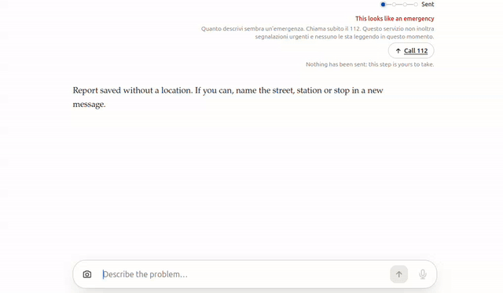

# segnalazioni-ai — the routing service behind SegnalaMi

**Claude Impact Lab Milano · 3 October 2026**

Routes a citizen's free-text report about Milan to the body actually responsible for it.

Receive text (and photos) → classify and extract with Claude → pick the competent body →
either transmit it, or hand the citizen a ready-to-send packet.

This is the **back half** of SegnalaMi. The chat people actually use — voice, photo,
geolocation, the whole citizen experience — lives in
**[FlXZ22/impact-lab](https://github.com/FlXZ22/impact-lab)**, which is also where the
Impact Lab submission README and the demo script live. This service has no UI; it answers
one HTTP call and knows who is responsible for what.

```
impact-lab (Node, the chat)                segnalazioni-ai (Java, this repo)
  POST /api/reports                          POST /api/v1/reports
    saves the report  ─── best-effort ───▶     classify · route · dispatch
    renders the card  ◀────────────────────    { analysis, nextStep }
```

The chat sets `ROUTING_URL` to point here. The call is best-effort in the strict sense:
if this service is slow, down or absent, the citizen's report still saves and the chat
simply shows no routing card. Nothing about the capture half depends on this one being up.

## Demo

Three screencasts of the two services running together. Each is the same pipeline —
one sentence in, a responsible body out — reaching a different answer.

### 1 · A broken lift at M3 Lodi → ATM

*"L'ascensore della stazione M3 Lodi è rotto da giorni, in carrozzina non riesco a uscire"*


Saved first, then routed: **ATM — Azienda Trasporti Milanesi**, their infoline hours and
stated 10-day response, and an **Open the form** button. Nobody picked a category, an
address or a recipient. Note that a station name alone was location enough — ATM indexes
its assets by stop, not by street address.

[Full video](docs/demo-1-atm-lift.mp4) · 27s

### 2 · An exposed cable → 112, and nothing else

*"C'è un cavo scoperto che penzola sulla rampa, rischio folgorazione"*


The card turns red before any body is chosen. The text says plainly that this service
does not forward urgent reports and nobody is reading it right now. A queue is the wrong
place for that report.

[Full video](docs/demo-2-emergency.mp4) · 20s

### 3 · Waste blocking a pavement → Amsa, one tap to dial

*"Ingombranti e cassonetti abbandonati bloccano il marciapiede in Via Paolo Sarpi 12"*



Same pipeline, different competence and a different channel: Amsa, 24 hours a day, and a
`tel:` link rather than a form.

[Full video](docs/demo-3-amsa-waste.mp4) · 19s

In all three the last line is the same — *"Nothing has been sent: this step is yours to
take."* That is the honest part, and the next section is why.

> ### 📄 [docs/municipality-handoff.md](docs/municipality-handoff.md) — the proposal to the Comune
>
> This service can route a report correctly but, for almost every body, cannot deliver
> it: no public body in Milan publishes a reporting API, and this project will not
> automate SPID sessions, private app endpoints or web forms to fake one. That gap is
> not closed by writing more code.
>
> The handoff document is what closes it. Written in Italian, addressed to the Comune's
> digital transformation office and to each agency, it asks for four things in order of
> cost: **verify the recipient table** (free), **open a dedicated mailbox** (very cheap),
> **publish a `POST /segnalazioni` endpoint that returns a real case number** (the actual
> goal), and **citizen identity last**. It carries a concrete JSON contract, the
> governance questions that are the administration's to answer, and a three-month
> single-category pilot. Hand that file over as-is.

## Who it can reach

Nine bodies, covering 17 categories. The competence table lives in
[`agencies.yml`](src/main/resources/agencies.yml) — configuration, not code.

**Delivered by the service today.** One body, one channel:

| Body | Covers | Channel |
|---|---|---|
| Comune — SOS Affitti | irregular rentals | **e-mail** — verified end to end over SMTP |

**Routed today, delivered by the citizen.** The service picks the body, writes the
report in the form that body expects, and returns a one-tap action (`tel:` link or form
URL) plus pre-filled text. The citizen presses send:

| Body | Covers | Channel |
|---|---|---|
| Comune — online reporting centre | roads, street cleaning, urban furniture, public green, cemeteries, abandoned vehicles, street lighting | web form (SPID/CIE) |
| Amsa | waste, overflowing bins, illegal dumps, bulky items, syringes | phone 800 33 22 99 / PULIamo app |
| ATM | metro, tram, bus, BikeMi | web form + infoline |
| Unareti | electrical distribution faults, blackouts | phone 803500 |
| Polizia Locale | non-urgent policing, illegal parking, degradation | phone 020208 |
| ARPA Lombardia (via the Comune) | noise, pollution, spills, odours | phone, via the Comune |
| Comune — outreach unit | people sleeping rough | phone 02 8844 7646 |
| Comune — 020202 | anything uncategorised, and every low-confidence report | phone / WhatsApp |

**Eventually, all of them directly.** Every body above is a candidate for machine
delivery the moment it offers a mailbox or an endpoint — the adapter seam is already
there ([`AgencyAdapter`](src/main/java/it/milano/segnalazioni/application/port/AgencyAdapter.java),
one class per new channel). Several of the phone numbers above came from secondary
sources and are marked `verified: "no"` in `agencies.yml`; confirming them is step one
of the handoff document.

Emergencies are never routed anywhere: any sign of immediate danger short-circuits to
`tel:112` before a body is chosen.

## Build status

| | |
|---|---|
| Classification and extraction | working, Claude structured outputs |
| Routing over 17 categories and 9 bodies | working, driven by `agencies.yml` |
| E-mail / PEC delivery | working, verified end to end over SMTP |
| Assisted handoff for every other channel | working |
| API delivery | seam in place, nothing to call yet |
| Evals | **missing** — see Known gaps |

## Run it

```bash
docker compose up -d                 # Mailpit, catches all outbound mail
mvn spring-boot:run
```

Boots with no API key: a keyword stand-in classifier takes over so the pipeline is
demonstrable offline. It is not a product — it says so in the startup log.

With Claude:

```bash
export ANTHROPIC_API_KEY=sk-ant-...
mvn spring-boot:run
```

To exercise a real SMTP send without touching a real public mailbox:

```bash
SOS_AFFITTI_EMAIL=test@localhost mvn spring-boot:run -Dspring-boot.run.profiles=demo
# then read it at http://localhost:8025
```

**Port note:** this service defaults to 8080, which is often already taken. Pass
`-Dspring-boot.run.arguments=--server.port=8081` if so — the demo script below uses 8081.

### Together with the chat

To reproduce the screencasts above, clone both repos side by side and let the frontend's
script start the pair:

```bash
git clone https://github.com/fabianhogger/segnalazioni-impact-lab-be.git segnalazioni_ai
git clone https://github.com/FlXZ22/impact-lab.git
cd impact-lab && npm install
./demo.sh                              # starts this service on 8081 and the chat on 3000
# or: ANTHROPIC_API_KEY=sk-... ./demo.sh
```

Then open **http://127.0.0.1:3000**. Without a key both halves still run: this service
falls back to a keyword classifier that handles the three demo sentences. The chat's
walkthrough is in its `DEMO.md`.

## Try it

```bash
curl -XPOST localhost:8081/api/v1/reports -H 'Content-Type: application/json' -d '{
  "text": "Discarica abusiva di rifiuti ingombranti in Via Paolo Sarpi 12"}'
```

```json
{
  "status": "AWAITING_CITIZEN_ACTION",
  "analysis": { "category": "RIFIUTI", "location": "Via Paolo Sarpi 12" },
  "nextStep": {
    "agencyId": "amsa", "action": "CALL", "deeplink": "tel:800332299",
    "prefilledText": "Discarica abusiva di rifiuti ingombranti.\nLuogo: Via Paolo Sarpi 12.\n…"
  }
}
```

| Endpoint | |
|---|---|
| `POST /api/v1/reports` | submit a report |
| `POST /api/v1/attachments` | upload a photo, returns an id to reference |
| `GET /api/v1/reports/{id}` | one case |
| `GET /api/v1/agencies` | the competence table as loaded |

## Sending real mail

Two rails, both on by default:

- `segnalazioni.dispatch.email.dry-run: true` — nothing leaves the process.
- `allowed-recipients` — with dry-run off, anything else is refused, not sent.

Turning both off means mailing a real public body. Confirm with that body first; the
reasoning is in `docs/municipality-handoff.md` §2.

## Where things are

```
domain/         Report, Classification, Agency, DispatchOutcome
application/    the pipeline + the ports it depends on
adapter/in/     HTTP
adapter/out/    llm (Claude) · agency (email, assisted, API seam) · persistence · storage
config/         agencies.yml and its startup validation
```

`src/main/resources/agencies.yml` is the competence table. It is configuration, not
code, and it is the file to correct when the Comune tells us we got a competence wrong.

## Docs

- `docs/architecture.md` — the pipeline, the safety rails, and what the service refuses to do
- `docs/adding-an-agency.md` — adding a body, a channel, or a category
- `docs/municipality-handoff.md` — the proposal for the Comune and the agencies (Italian)

## Known gaps

- **No eval.** The largest gap. Prompt changes are currently judged by intuition.
  `docs/adding-an-agency.md` describes what to build.
- Dispatch is inline, so a slow SMTP server is a slow HTTP response.
- H2 on disk and photos on the local filesystem — single instance only.
- No authentication on the API, and no rate limiting. Required before public exposure.
- **Italian only.** `nextStep.message` is always Italian, so with the chat's English UI
  the card shows an English heading over an Italian body — visible in the screencasts
  above. Fixing it means returning a language-keyed message from here.
- Two independent Claude classifications run per report (the chat's own triage assessor
  and this service's classifier). They answer different questions, but unifying them is
  the obvious next refactor.
